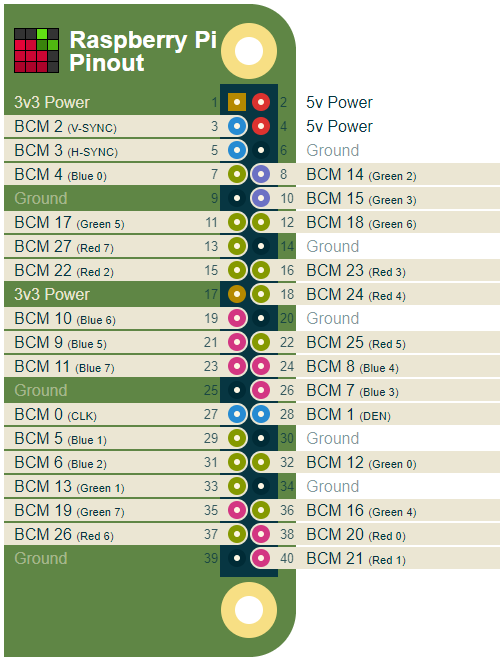
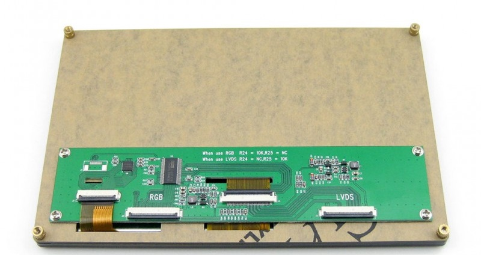
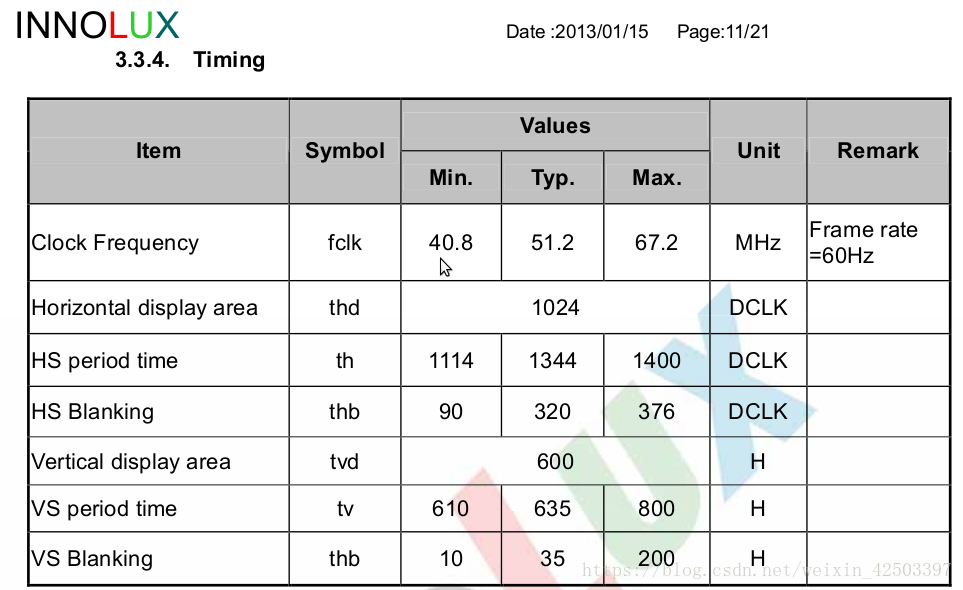
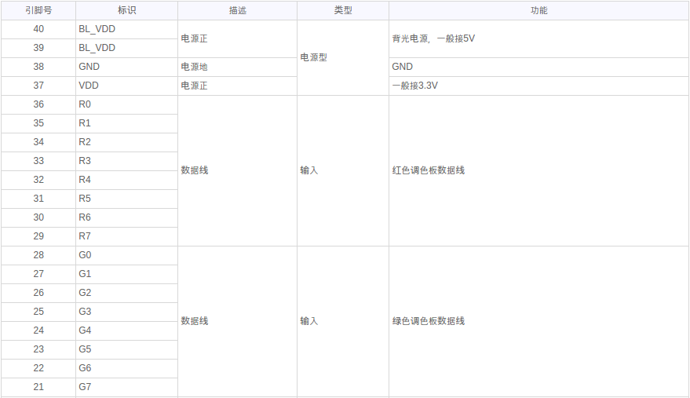
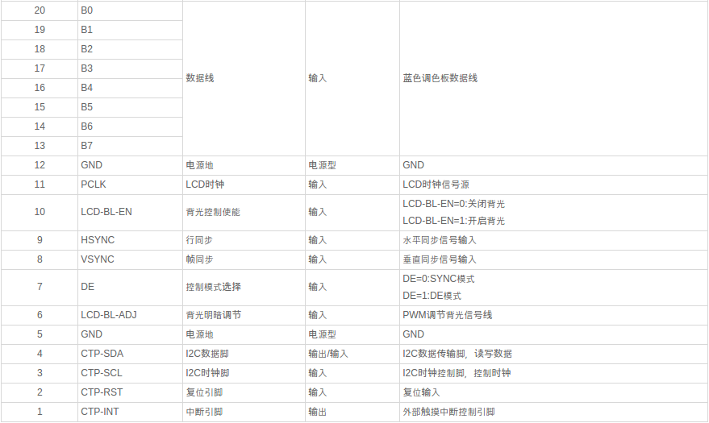

# Study note of waveshare 7 inch DSI LCD 1024x600 for Raspberry

   

  
## Waveshare 7inch Display for Raspberry Pi, 1024x600, DPI Interface
https://www.waveshare.com/7inch-lcd-for-pi.htm 
   
  
## Waveshare 7inch Capacitive Touch LCD (D) 1024x600
https://www.waveshare.com/7inch-capacitive-touch-lcd-d.htm 
   

### back view
       
  
### LCD timing
     
  
### pin assignment
     
     
